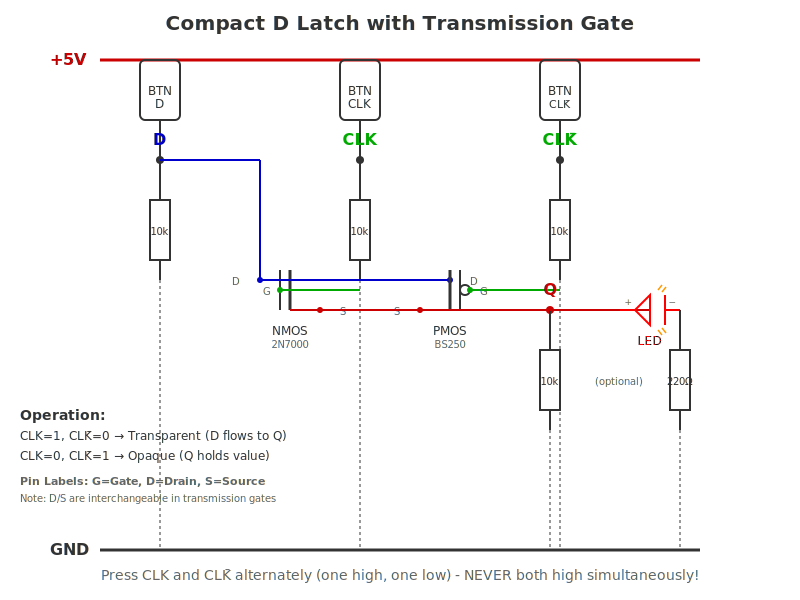

# Building a Compact D Latch with Transmission Gate

## Overview
This tutorial will guide you through building the simple D latch from Figure 3.12(a) using discrete MOSFETs and push buttons. You'll experience the two major limitations: **floating output nodes** and **lack of buffers**.

---

## What You'll Need

### Components
- **1× N-channel MOSFET** (2N7000 or BS170)
- **1× P-channel MOSFET** (BS250 or similar)
- **3× Push buttons** (momentary, normally open) - for D, CLK, and CLK̄
- **3× Pull-down resistors** (10kΩ) - one for each button input
- **1× Pull-down resistor** (10kΩ, optional for Q output observation)
- **1× LED** (any color)
- **1× Current limiting resistor** (220Ω - 1kΩ)
- **Power supply** (5V or use USB power/batteries)
- **Breadboard and jumper wires**

### Optional but Recommended
- Multimeter or logic probe
- Oscilloscope (to see charge leakage over time)

---

## Circuit Description

The transmission gate acts as a **pass gate**:
- When **CLK = 1** and **CLK̄ = 0**: Gate is ON → D flows to Q (transparent)
- When **CLK = 0** and **CLK̄ = 1**: Gate is OFF → Q is isolated (opaque/hold)

### The Transmission Gate
A transmission gate uses both NMOS and PMOS in parallel:
- **NMOS**: Good at passing 0s (low voltages)
- **PMOS**: Good at passing 1s (high voltages)
- **Together**: Can pass both logic levels effectively

---

## Complete Breadboard Circuit

See the detailed SVG circuit diagram below showing all connections with proper MOSFET pinouts:

**Pin Connections Summary:**
- **D Input**: Button to +5V, 10kΩ pull-down to GND
- **CLK Input**: Button to +5V, 10kΩ pull-down to GND  
- **CLK̄ Input**: Button to +5V, 10kΩ pull-down to GND (press when CLK is released)
- **NMOS (2N7000)**: Gate→CLK, Drain→D, Source→Q
- **PMOS (BS250)**: Gate→CLK̄, Drain→D, Source→Q
- **Q Output**: Optional 10kΩ pull-down, LED through 220Ω to GND

The diagram shows all three pins (G, D, S) for each MOSFET clearly labeled.

---

## Step-by-Step Build

### Step 1: Set Up Power Rails
1. Connect +5V and GND rails on your breadboard
2. Double-check polarity with a multimeter

### Step 2: Build the D Input (Data Button)
1. Connect one side of Button D to +5V
2. Connect the other side to a node we'll call "D"
3. Add a 10kΩ pull-down resistor from D to GND
4. **Result**: Pressing button → D = 1, releasing → D = 0

### Step 3: Build the CLK Input (Clock Button)
1. Connect one side of Button CLK to +5V
2. Connect the other side to a node we'll call "CLK"
3. Add a 10kΩ pull-down resistor from CLK to GND
4. **Result**: Pressing button → CLK = 1, releasing → CLK = 0

### Step 4: Create CLK̄ (Inverted Clock)
For this simple demo, use a **third button for CLK̄**:
- Press CLK̄ button → CLK̄ = 1
- Release CLK̄ button → CLK̄ = 0
- **Important**: Press CLK and CLK̄ alternately - when one is pressed, the other should be released

*Alternative: Use a NOT gate (like 74HC04) or build a simple NMOS inverter with a pull-up resistor*

### Step 5: Build the Transmission Gate
1. Place NMOS (T1) and PMOS (T2) side by side
2. Connect the **Drains and Sources in parallel**:
   - Connect D input to the drain (or source) end of both transistors
   - Connect Q output node to the source (or drain) end of both transistors
   - *Note: In transmission gates, drain/source are interchangeable due to bidirectional operation*
3. Connect the **Gates**:
   - NMOS gate to CLK
   - PMOS gate to CLK̄

### Step 6: Add Output Indicator
**Recommended (High-Active - easier to observe):**
1. Connect LED anode (long leg) to Q node
2. Connect LED cathode (short leg) through 220Ω resistor to GND
3. LED lights when Q = 1 (HIGH)

**Alternative (Low-Active):**
- Connect LED cathode to Q, anode through resistor to +5V
- LED lights when Q = 0 (LOW, sinking current)

### Step 7: Optional Pull-down on Q
Add a 10kΩ resistor from Q to GND to help observe floating behavior

---

## Testing & Experiencing the Limitations

### Basic Operation Test
1. **Set D = 0** (button released)
2. **Press CLK** (CLK = 1, CLK̄ = 0) → Transparent mode
3. **Observe Q = 0** (LED state)
4. **Release CLK** (CLK = 0, CLK̄ = 1) → Opaque mode
5. **Press D button** (D = 1)
6. **Q should remain at 0** (latched)
7. **Press CLK again** → Q should now follow D and become 1
8. **Release CLK** → Q should stay at 1

### Limitation 1: Floating Output Node

**Experiment A - Charge Leakage**
1. Set D = 1, press CLK to load a HIGH into Q
2. Release CLK (Q is now isolated)
3. **Remove the pull-down resistor** if present
4. **Wait and observe Q over time** (use multimeter)
   - Q voltage will gradually decay
   - Leakage currents discharge the floating node
   - LED may dim or change state unexpectedly

**Experiment B - Noise Sensitivity**
1. Load Q = 1, enter opaque mode (CLK = 0)
2. **Touch Q node with your finger** or bring your hand near
3. Body capacitance and EMI can change Q's state!
4. Try waving a phone or other electronic device near Q

### Limitation 2: No Buffers

**Experiment C - Backward Drive (nMOS path)**
1. Load Q = 1, enter opaque mode
2. **Touch D input node** or connect it briefly to GND
3. If there's enough coupling or you force D LOW:
   - Noise can conduct through the symmetric transmission gate
   - You might see Q get disturbed
4. **The transmission gate is bidirectional** - current can flow both ways

**Experiment D - On-Resistance Effects**
1. Load Q = 1, enter opaque mode
2. Connect a 1kΩ load resistor from Q to GND
3. Measure Q voltage - you may see a slight drop (to ~4.7-4.9V) due to MOSFET on-resistance (~10-100Ω)
4. This is not a threshold voltage issue (the parallel NMOS-PMOS eliminates Vth drops)
5. **A proper latch would drive Q strongly through low-impedance buffers**

**Experiment E - External Load Effect**
1. Load Q = 1, enter opaque mode
2. Connect a 1kΩ resistor from Q to GND momentarily
3. The floating node Q will quickly discharge
4. Remove resistor - Q stays LOW even though you latched a HIGH
5. **A proper latch would drive Q strongly and resist this**

---

## What You've Learned

### Floating Nodes are Problematic
- Without active drive, Q loses its state to leakage
- Real circuits need the full latch with cross-coupled inverters

### Buffers are Essential
- Neither D nor Q should be exposed to the outside world
- Input buffers protect D from backward drive
- Output buffers actively drive Q and isolate the storage node

### Why Commercial ICs Don't Use This Design
This compact latch is **too fragile** for real use:
- Noise immunity is poor
- State retention is unreliable
- Cannot drive significant loads

The full D latch in Figure 3.12(b) adds:
- Input inverters to buffer D
- Cross-coupled inverters for stable state storage
- Output buffers for strong drive capability

---

## Next Steps

1. **Build the full latch** from Figure 3.12(b) and compare behavior
2. **Add a NOT gate** to properly generate CLK̄
3. **Build a D flip-flop** using two latches (master-slave configuration)
4. **Measure charge decay** with an oscilloscope over seconds/minutes

---

## Safety Notes
- MOSFET gates are ESD-sensitive - handle carefully
- Never exceed component voltage ratings
- Double-check power connections before applying power
- Use current limiting resistors with LEDs

---

**Happy experimenting! You're now experiencing firsthand why real digital circuits need proper buffering and why transmission gates alone aren't enough for reliable state storage.**
